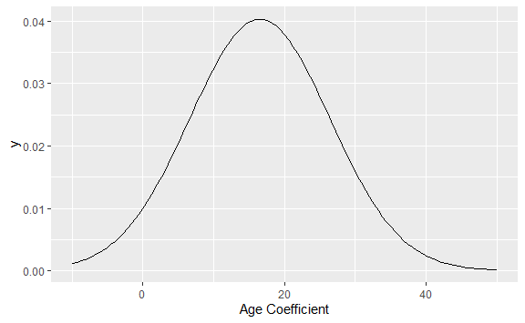
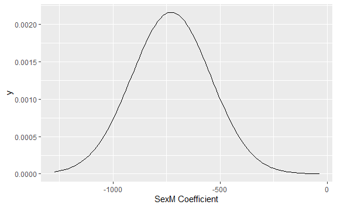

12 Confidence in Models
================
Boukara Ahmed El-Hachemi
17/07/2020

> Doubt is not a pleasant condition, but certainty is an absurd one. –
> Voltaire (1694-1778), French writer and philosopher

If you are a skilled modeler, you try to arrange things so that your
model coefficients are random numbers.

Recall the steps in building a statistical model:

1.  Collect data. This is the hardest part, often involving great effort
    and expense.
2.  Design your model, choosing the response variable, the explanatory
    variables, and the model terms. (It’s sensible to have the design in
    mind before you collect your data, so you know what data are
    needed.)
3.  Fit the model design to your data.

It’s step (1) that introduces the randomness.

Insofar as the sample is random, the coefficients that come from fitting
the model design to the sample are also random. After all, the randomly
selected sample is unlikely to be an exact match to the entire
population.

When the sample is not the entire population, repeating the study won’t
give the same result every time because the sample will include
different members of the population. If the results vary wildly from one
repeat to another, you have reason to think that the results are not a
reliable indication of the population. If the results vary only a small
amount from one repeat to another, then there’s reason to think that you
have closely approximated the results that you would have gotten if the
sample had been the entire population. The repeatability of the process
indicates how well the modeler knows the coefficients, or, in a word,
the ***precision*** of the coefficients.

Knowing the precision of coefficients is key in drawing conclusions from
them.

This chapter introduces methods that can be used to estimate the
precision of coefficients from data. A standard format for presenting
this estimation is the ***confidence interval***. For instance, from
Galton’s data, the estimated coefficient on `mother` is 0.32 ± 0.06,
giving confidence that a different sample would also show a non-zero
coefficient.

It’s important to contrast precision with ***accuracy***. Precision is
about repeatability. Accuracy is about how the result matches the real
world. Ultimately, accuracy is what the modeler wants. A major reason to
introduce modeling techniques beyond the simple group-wise models of
Chapter 4 is to enable you to account for the multiple factors that
shape outcomes. But the results of a model always depend on the choices
the modeler makes, e.g., which explanatory variables to include, how to
choose a sample, etc. The results can be accurate only if the modeler
makes good choices. Knowing whether this is the case depends on knowing
how the world really works, and this is what you are seeking to find out
in the first place. Accuracy is elusive knowledge. Precision will have
to suffice.

## 1 The Sampling Distribution & Model Coefficients

The same principles of sampling and re-sampling distributions introduced
in Chapter 5 can be used to find confidence intervals on model
coefficients.

To illustrate, consider the `TenMileRace` dataset (in the `mosaicData`
package).

The variable `net` records the start-line to finish-line time of each
runner. There are also variables `age` and `sex`. Any model would do to
illustrate the sampling distribution. Try `net` \~ 1 + `age` + `sex`.

``` r
mod <- lm(net ~ 1 + age + sex, data = TenMileRace)
```

Just for reference, here are the coefficients when the model is fit to
the entire population:

    ## (Intercept)         age        sexM 
    ##  5339.15545    16.89362  -726.61948

The coefficients indicate that runners who are one year older tend to
take about 17 seconds longer to run the 10 miles.

Of course, if you knew the coefficients that fit the whole population,
you would hardly need to collect a sample\! But the purpose here is to
demonstrate the effects of a random sampling process. The table below
gives the coefficients from several sampling draws; each sample has
n=100 cases randomly selected from the population. That is, each sample
simulates the situation where someone has randomly selected n=100 cases.

    ##   Intercept       age       sexM     sigma  r.squared         F numdf dendf
    ## 1  5075.012 27.103372  -966.5419  984.9049 0.20147409 12.236914     2    97
    ## 2  4796.443 32.657859  -853.0587  825.3364 0.21844445 13.555730     2    97
    ## 3  5049.671 26.371649  -901.3622  819.9449 0.20543748 12.539879     2    97
    ## 4  4862.259 37.426648 -1108.1257  987.6767 0.24825668 16.016702     2    97
    ## 5  5892.902  4.098562  -498.7974  918.8549 0.06917736  3.604448     2    97
    ## 6  5687.566  6.002495  -555.4589  829.5799 0.09880637  5.317513     2    97
    ## 7  4916.011 33.387291  -968.2102 1028.3550 0.18336970 10.890400     2    97
    ## 8  5091.485 23.591077  -760.7436 1014.4731 0.15294584  8.757259     2    97
    ##   .row .index
    ## 1    1      1
    ## 2    1      2
    ## 3    1      3
    ## 4    1      4
    ## 5    1      5
    ## 6    1      6
    ## 7    1      7
    ## 8    1      8

Judging from these few samples, there is a lot of variability in the
coefficients. For example, the age coefficient ranges fro 4.1 to 37.43
in just these few samples. Figure below shows the distribution of
coefficients for the age and sex coefficients for the first eight out of
1000 repeats of the sampling process. Each of the samples has 100 cases
randomly selected from the population. These distributions, which
reflect the randomness of the sampling process, are called sampling
distributions . It’s very common for sampling distributions to be
bell-shaped and to be centered on the population value.



The width of the sampling distribution shows the reliability or
repeatability of the coefficients. There are two common ways to
summarize the width: the standard deviation and the 95% coverage
interval.

An important item to add to your vocabulary is the “standard error.”

> Sampling distributions, like other distributions, have standard
> deviations. The term ***standard error*** is used to refer to the
> standard deviation of a sampling distribution.

For the `age` coefficient, the standard error is about 9.5 seconds per
year (keeping in mind the units of the data), and the standard error in
`sexM` is about 192 seconds. These standard errors were calculated by
drawing 10,000 repeats of samples of size n = 100, and fitting the model
to each of the 10000 samples. This is easy to do on the computer, but
practically impossible in actual field work.

Every model coefficient has its own standard error which indicates the
precision of the coefficient. The size of the standard error depends on
several things:

  - The quality of the data. The precision with which individual
    measurements of variables is made, or errors in those measurements,
    translates through to the standard errors on the model
    coefficients.  
  - The quality of the model. The size of standard errors is
    proportional to the size of the residuals, so a model that produces
    small residuals tends to have small standard errors. However,
    collinearity or multi-collinearity among the explanatory variables
    tends to inflate standard errors.
  - The sample size n. Standard errors tend to get tighter the more data
    is used to fit the model. A simple relationship holds very widely;
    it’s worth remembering this rule:

The standard error typically gets smaller as the sample size n
increases, but slowly; it’s proportional to 1/√n. This means, for
instance, that to make the standard error 10 times smaller, you need a
dataset that is 100 times larger.

## 2 Standard Errors and the Regression Report

Finding the standard error of a model coefficient would be
straightforward if one could follow the procedure above: repeatedly draw
new samples from the population, fit the model to each new sample, and
collect the resulting coefficients from each sample to produce the
sampling distribution. This process is impractical, however, because of
the expense of collecting new samples.

Fortunately, there can be enough information in the original sample to
make a reasonable guess about the sampling distribution. How to make
this guess is the subject of Section 5.4. For now, it suffices to say
that the guess is based on an approximation to the sampling distribution
called the ***resampling distribution*** .

A conventional report from software, often called a ***regression
report***, provides an estimate of the standard error. Here is the
regression report from the model `net` \~ 1 + `age` + `sex` fitted to a
sample of size n = 50 from the running data:

``` r
            Estimate Std..Error t.value  p.value
(Intercept)   5250.0     34.800   151.0 p<0.0001
age             19.9      0.937    21.3 p<0.0001
sexM          -744.0     20.100   -37.1 p<0.0001
```

The coefficient itself is in the column labelled “Estimate.” The next
column, labelled “Std. Error,” gives the standard error of each
coefficient. You can ignore the last two columns of the regression
report for now. They present the information from the first two columns
in a different format.

## 3 Confidence Intervals

The regression report gives the standard error explicitly, but it’s
common in many fields to report the precision of a coefficient in
another way, as a ***confidence interval***. This was introduced in
Chapter 5 in the context of group-wise models, but it applies to other
sorts of models as well.

A confidence interval is a little report about a coefficient like this
one about the `age` coefficient in the regression table above: “29 ± 18
with 95% confidence.” The confidence interval involves three components:

  - ***Point Estimate*** The center of the confidence interval: 29 here.
    Read this directly from the regression report.
  - ***Margin of Error*** The half-width of the confidence interval: 18
    here. This is two times the standard error from the regression
    report.
  - ***Confidence Level*** The percentage of the coverage interval. This
    is typically 95%. Since people get tired of saying the same thing
    over and over again, they often omit the “with 95% confidence” part
    of the report. This can be dangerous, since sometimes people use
    confidence levels other than 95%.

The purpose of multiplying the standard error by two is to make the
confidence interval approximate a 95% coverage interval of the
resampling distribution.

#### Example: Wage discrimination in trucking?

Section 10.4 looked at data from a trucking company to see how earnings
differ between men and women. It’s time to revisit that example, using
confidence intervals to get an idea of whether the data clearly point to
the existence of a wage difference.

The model `earnings` \~ `sex` ascribed all differences between men and
women to their sex itself. Here is the regression report:

``` r
               Estimate Std. Error  t value   p value
Intercept         35501       2163    16.41    0.0001
sexM               4735       2605     1.82    0.0714
```

The estimated difference in earnings between men and women is $4700 ±
5200 – not at all precise.

Another model can be used to take into account the worker’s experience,
using age as a proxy:

``` r
              Estimate  Std. Error  t value p value
Intercept        14970        3912     3.83  0.0002
sexM              2354        2338     1.01  0.3200
age              594            99     6.02  0.0001
```

Earnings go up by $600 ± 200 for each additional year of age. The model
suggests that part of the difference between the earnings of men and
women at this trucking company is due to their age: women tend to be
younger than men. The confidence interval on the earnings difference is
very broad – $2350 ± 4700 – so broad that the sample doesn’t provide
much evidence for any difference at all.

One issue is whether the age dependence of earnings is just a mask for
discrimination. To check out this possibility, fit another model that
looks at the age dependence separately for men and women:

``` r
            Estimate    Std. Error  t value p value
Intercept      17178          8026     2.14  0.0343
sexM            −443          9174    −0.05  0.9615
age            530         225     2.35  0.0203
sexM:age          79           251     0.32  0.7530
```

The coefficient on the interaction term between `age` and `sex` is 79 ±
502 – no reason at all to think that it’s different from zero. So,
evidently, both women and men show the same increase in earnings with
age.

Notice that in this last model the coefficient on `sex` itself has
reversed sign from the previous models: Simpson’s paradox. But note also
that the confidence interval is very broad: −443 ± 18348. Since the
confidence interval includes zero, there is not good evidence to
conclude that the coefficient is distinguishable from zero.

The broad confidence interval stems from the multi-collinearity between
`age` and `sex` and their interaction term. As discussed in Section
12.6, sometimes it is necessary to leave out model terms in order to get
reliable results.

#### Example: SAT Scores and Spending, revisited

The example in Section 10.6 used data from 50 US states to try to see
how teacher salaries and student-teacher ratios are related to test
scores. The model used was `sat` \~ `salary`+`ratio`+`frac`, where
`frac` is a covariate – what fraction of students in each state took the
SAT. To interpret the results properly, it’s important to know the
confidence interval of the coefficients:

``` r
            Estimate    Std. Error  t value p value
Intercept     1057.9          44.3    23.86  0.0000
salary         2.5         1.0     2.54  0.0145
ratio           −4.6           2.1    −2.19  0.0339
frac            −2.9           0.3   −12.76  0.0000
```

The confidence interval on `salary` is 2.5 ± 2.0, leaving little doubt
that the data support the idea that higher salaries are associated with
higher test scores. Higher student-faculty ratios seem to be associated
with lower test scores. You can see this because the confidence interval
on `ratio`, −4.6 ± 4.2, doesn’t cover zero. The important role of the
covariate `frac` is also confirmed by its tight confidence interval away
from zero.

Collecting more data would allow more precise estimates to be made. For
instance, collecting data over 4 years would reduce the standard errors
in half, although what the estimates would be with the new data cannot
be known until the analysis is done.

> **Confidence intervals for very small samples.**

> When you have data with a very small n, say n \< 20, a multiplier of 2
> can be misleading. The reason has to do with how well a small sample
> can be assumed to represent the population. The correct multiplier
> depends on the difference between the sample size n and the number of
> model coefficients m:

| n-m                                 |    1 |   2 |   3 |   5 |  10 |  15 |
| :---------------------------------- | ---: | --: | --: | --: | --: | --: |
| Multiplier for 95% confidence level | 12.7 | 4.3 | 3.2 | 2.6 | 2.2 | 2.1 |

For example, if you fit the running time versus age and sex model to 4
cases, the appropriate multiplier should be 12.7, not even close to 2.

## 4 Confidence in Predictions

When a model value is used for making a prediction, the coefficients
themselves aren’t of direct interest; it’s the prediction that counts.
Just as the precision of a coefficient can be established, each
prediction has a precision that can be described using a confidence
interval.

To illustrate, consider making a prediction of a child’s adult height
when you know the heights of the mother and father and the child’s sex.
Using Galton’s data from the 19th century, a simple and appropriate
model is `height` \~ `sex` + `mother` + `father`.

``` r
              Estimate  Std. Error  t value p-value
Intercept      15.3448      2.7470     5.59  0.0000
sexM            5.2260      0.1440    36.29  0.0000
mother        0.3215        0.0313    10.28  0.0000
father        0.4060        0.0292    13.90  0.0000
```

Now consider a hypothetical man – call him Bill – whose mother is 67
inches tall and whose father is 69 inches tall. According to the model
formula, Bill’s predicted height is 15.3448 + 5.226 + 0.3215 × 67 +
0.406 × 69 = 70.13 inches.  
One way to calculate a confidence interval on a model value is similar
to bootstrapping. Conduct many trials on resampled data. For each trial,
fit the model and calculate the model value from the resulting
coefficients. The spread of the various model values from the trials
gives the standard error and confidence interval. For Bill, the 95%
confidence interval on his model height works out to be 70.13 ± 0.27
inches: a precision of about a quarter of an inch. This high precision
reflects the small standard errors of the coefficients which arise in
turn from the large amount of data used to fit the model.

It is wrong to interpret this interval as saying something about the
actual range of heights of men like Bill, that is, men whose mother is
67 inches and father 69 inches. The model-value confidence interval
should not be interpreted as saying that 95 percent of such men will
have heights in the interval 70.13 ± 0.27. Instead, this interval means
that if you were to fit a model based on the entire population – not
just the 898 cases in Galton’s data – the model you would fit would
likely produce a model value for Bill close to 70.13. In other words,
the model-value confidence interval is not so much about the uncertainty
in Bill’s height as in what the model has to say about the average for
men like Bill.

If you are interested in what the model has to say about the uncertainty
the prediction of Bill’s height, you need to ask a different question
and compute a different confidence interval. The ***prediction
confidence interval*** takes into account the spread of the cases around
their model values: the residuals. For the model given above, the
standard deviation of the residuals is 2.15 inches – a typical person
varies from the model value by that amount.

The prediction confidence interval takes into account this case-by-case
residual to give an indication of the range of heights into which the
actual value is likely to fall. For men like Bill, the 95% prediction
interval is 70.13 ± 4.24 inches. This is much larger than the interval
on the model values, and reflects mainly the size of the residual of
actual cases around their model values.

#### Example: Catastrophe in Grand Forks

In April 1997, there was massive flooding on the Red River in Minnesota
and North Dakota, states in the northern US, due to record setting
winter snows. The towns of Grand Forks and East Grand Forks were
endangered and the story was in the news. I remember hearing a news
report saying that the dikes in Grand Forks could protect against a
flood level of 50 feet and that the National Weather Service predictions
were for the river to reach a maximum of 47.5 to 49 feet. To the
reporter and the city planners, this was good news. The city had never
been better prepared and the preparations were paying off. To me, even
knowing nothing about the area, the report was a sign of trouble. What
kind of confidence interval was this 47.5 to 49? No confidence level was
reported. Was it at a 50% level, was it at a 95% level? Was it a
confidence interval on the model values alone or did it include the
residuals from the model values? Did it take into account the
extrapolation involved in handling record-setting conditions? Nothing in
the news stories gave any insight into how precise previous predictions
had been.

In the event, the floods reached 54.11 feet in Grand Forks, overtopping
the dikes and inundating both towns. Damage was estimated to be more
than $1 billion, a huge amount given the small population of the area.

Looking back on the history of predictions from the National Weather
Service, the typical residual was about 11% of the prediction. Thus, a
reasonable 95% confidence interval might have been ±22%, or, translated
to feet, 48 ± 10 feet. Had this interval been presented, the towns might
have been better prepared for the actual level of 54.11 feet, well
within the confidence band.

confidence intervals need to come with a clear statement of what they
mean. For disaster planning, a model-value confidence interval is not so
useful – it’s about the quality of the model rather than the uncertainty
in the actual outcome.

## 5 A Formula for the Standard Error

When you do lots of simulations, you start to see patterns. Sometimes
these patterns are strong enough that you can anticipate the result of a
simulation without doing it. For example, suppose you generate two
random vectors A and B and calculate their correlation coefficient: the
cosine of the angle between them. You will see some consistent patterns.
The distribution of correlation coefficients will have zero mean and it
will have standard deviation of 1/√n. 

Traditionally, statisticians have looked for such patterns in order save
computational work. Why do a simulation, repeating something over and
over again, if you can anticipate the result with a formula?

Such formulas exist for the standard error of a model coefficient. They
are implemented in statistical software and used to generate the
regression report. Here is a formula for computing the standard error of
the coefficient on a model vector B in a model with more than one
explanatory vector, e.g., A \~ B + C + D. You don’t need to use this
formula to calculate standard errors; the software will do that. The
point of giving the formula is to show how the standard error depends on
features of the model, so that you can strategize about how to design
your models to give suitable standard errors.

\[\mbox{standard error of B coef.} = |\mbox{residuals}|\frac{1}{|\mbox{B}|}\ 
\frac{1}{\sin( \theta )}\ \frac{1}{\sqrt{n}}\ \sqrt{\frac{n}{n-m}} . \]

There are five components to this formula, each of which says something
about the standard error of a coefficient:

  - |residuals| – The standard error is directly proportional to the
    size of the residuals.

  - 1/|B| – The length of the model vector reflects the units of that
    variable or, for the indicator vector for a categorical variable,
    how many cases are at the corresponding level.

  - 1/sin(θ) – This is the magnifying effect of collinearity. θ is the
    angle between explanatory vector B and all the other explanatory
    vectors. More precisely, it is the angle between B and the vector
    that would be found by fitting B to all the other explanatory
    vectors. When θ is 90°, then sin(θ)=1 and there is no collinearity
    and no magnification. When θ = 45°, the magnification is only 1.4.
    But for strong collinearity, the magnification can be very large:
    when θ = 10°, the magnification is 5.8. When θ = 1°, magnification
    is 57. For θ = 0, the alignment becomes a matter of redundancy,
    since B can be exactly modeled by the other explanatory variables.
    Magnification would be infinite, but statistical software will
    identify the redundancy and eliminate it.

  - 1/√n – This reflects the amount of data. Larger samples give more
    precise estimates of coefficients, that is, a smaller standard
    error. Because of the square-root relationship, quadrupling the size
    of the sample will halve the size of the standard error. To improve
    the standard error by ten-fold requires a 100-fold increase in the
    size of the sample.

  - √(n/(n-m)) – The fitting process chooses coefficients that make the
    residuals as small as possible consistent with the data. This tends
    to underestimate the size of residuals – for any other estimate of
    the coefficients, even one well within the confidence interval, the
    residuals would be larger. This correction factor balances this bias
    out. n is, as always, the number of cases in the sample and m is the
    number of model vectors. So long as m is much less than n, which is
    typical of models, the bias correction factor is close to 1.

The formula suggests some ways to build models that will have
coefficients with small standard errors.

  - Use lots of data: large n.
  - Include model terms that will account for lots of variation in the
    response variable and thereby produce small residuals.
  - But avoid collinearity.

The next section emphasizes the problems that can be introduced by
collinearity.

## 6 Confidence and Collinearity

One of the key decisions that a modeler makes is whether to include an
explanatory term; it might be a main term or it might be an interaction
term or a transformation term.

The starting point for most people new to statistics might be summarized
as follows:

  - **Methodologically Ignorant Approach**. Include just one explanatory
    variable.

Most people who work with data can understand tabulations of group means
(in modeling language, A \~ 1 + G, where G is a categorical variable) or
simple straight-line models (A \~ 1 + B, where B is a quantitative
variable.)

At this point, the reader of this book should understand how to include
in a model multiple explanatory variables and terms such as
interactions. When people first learn this, they typically start putting
in lots of terms:

  - **Greedy Approach**. Include everything, just in case.

The idea here is that you don’t want to miss any detail; the fitting
technology will untangle everything.

Perhaps the word “greedy” is already signalling the problem in a
metaphorical way. The poet Horace (65-8 BC) wrote, “He who is greedy is
always in want.” Or Seneca (1st century AD), “To greed, all nature is
insufficient.”

The flaw with the greedy approach to statistical modeling is not a moral
fault. If adding a term improves your model, go for it\! The problem is
that, sometimes, adding a term can hurt the model by dramatically
inflating standard errors.

To illustrate, consider a set of models of `wage` from the Current
Population Survey 85 dataset: `CPS85`. A relatively simple model might
take just the worker’s education into account: `wage` \~ 1 + `educ`:

``` r
              Estimate        Std. Error      t value     p value
Intercept       −0.746           1.045        −0.71      0.4758
educ             0.750           0.079         9.53      0.0000
```

The coefficient on `educ` says that a one-year increase in education is
associated with a wage that is higher by 75 cents/hour. (Remember, these
data are from the mid-1980s.) The standard error is 8 cents/hour per
year of education, so the confidence interval is 75 ± 16 cents/hour per
year of education.

A slightly more elaborate model includes `age` as a covariate. This
might be important because education levels typically are lower in older
workers, so a comparison of workers with the same level of education
ought to hold `age` constant. A simple adjustment will take that into
account. Here’s the regression table on the model `wage` \~ 1 + `educ` +
`age`:

``` r
           Estimate   Std. Error      t value       p value
Intercept      −5.534          1.279        −4.33        0.0001
educ            0.821          0.077        10.66        0.0001
age           0.105        0.017         6.11        0.0001
```

In this new model, the coefficient on `educ` slightly from 75 to 82
cents/hour per year of education while leaving the standard error more
or less the same.

Of course, wages also depend on experience. Every year of additional
education tends to cut out a year of experience. Here is the regression
report from the model `wage` \~ 1 + `educ` + `age` + `exper`:

``` r
             Estimate     Std. Error      t value       p value
Intercept      −4.770          7.042        −0.68        0.4985
educ            0.948          1.155       0.82      0.4121
age          −0.022        1.155        −0.02        0.9845
exper           0.128          1.156         0.11        0.9122
```

Look at the regression table carefully. The standard errors have
exploded\! The confidence interval on `educ` is now 95 ± 231 cents/hour
per year of education – a very imprecise estimate. Indeed, the
confidence interval now includes zero, so the model is consistent with
the skeptic’s claim that education has no effect on wages, once you hold
constant the level of experience and age of the worker.

A better interpretation is that greed has gotten the better of the
modeler. The large standard errors in this model reflect a deficiency in
the data: the multi-collinearity of `exper` with `age` and `educ` as
described in in the example in Section 8.4.

A simple statement of the situation is this:

> Collinearity and multi-collinearity cause model coefficients to become
> less precise – they increase standard errors.

This doesn’t mean that you should never include model terms that are
collinear or multi-collinear. If the precision of your estimates is good
enough, even with the collinear terms, then there is no problem. You,
the modeler, can judge if the precision is adequate for your purposes.

The estimate 95 ± 231 cents/hour is probably not precise enough for any
reasonable purpose. Including the `exper` term in the model has made the
entire model useless, not just the `exper` term, but the other terms as
well\! That’s what happens when you are greedy.

The good news is that you don’t need to be afraid of trying a model
term. Use the standard errors to judge when your model is acceptable and
when you need to think about dropping terms due to collinearity.

### Aside: Redundancy and Multi-collinearity

Redundancy can be seen as an extreme case of multi-collinearity. So
extreme that it renders the coefficients completely meaningless. That’s
why statistical software is written to delete redundant vectors. With
multi-collinearity, things are more of a judgment call. The judgment
needs to reside in you, the modeler.

## 7 Confidence and Bias

The margin of error tells you about the precision of a coefficient: how
much variation is to be anticipated due to the random nature of
sampling. It does not, unfortunately, tell you about the accuracy of the
coefficient; how close it is to the “true” or “population” value.

A coefficient makes sense only within the context of a model. Suppose
you fit a model A \~ B + C. Then you think better of things and look at
the model A \~ B + C + D. Unless variable D happens to be orthogonal to
B and C, the coefficients on B and C are going to change from the first
model to the second.

If you take the point of view that the second model is “correct,” then
the coefficients you get from the first model are wrong. That is, the
omission of D in the first model has biased the estimates of B and C.

On the other hand, if you think that the model A \~ B + C reflects the
“truth,” then the coefficients on B and C from A \~ B + C + D are
biased.

The margin of error from any model tells you nothing about the potential
bias. How could it? In order to measure the bias you would have to know
the “correct” or “true” model.

The issue of bias often comes down to which is the correct set of model
terms to include. This is not a statistical issue – it depends on how
well your model corresponds to reality. Since people disagree about
reality, perhaps it would be best to think about bias with respect to a
given theory of how the world works. A model that produces unbiased
coefficients according to your theory of reality might give biased
coefficients with respect to someone else’s theory. Avoiding bias is a
difficult matter and it’s hard to know when you have succeeded. A very
powerful but challenging strategy is to intervene to make your system
simpler, so that every modeler’s theories can agree. See Chapter 18.

## Computational technique

Regression reports are generated using software you have already
encountered: `lm` to fit a model and `summary` to construct the report
from the fitted model. To illustrate with the `SwimRecords` data from
the `mosaicData` package:

``` r
mod <- lm(time ~ year + sex, data = SwimRecords)
summary(mod)
```

    ## 
    ## Call:
    ## lm(formula = time ~ year + sex, data = SwimRecords)
    ## 
    ## Residuals:
    ##     Min      1Q  Median      3Q     Max 
    ## -4.7027 -2.7027 -0.5968  1.2796 19.0759 
    ## 
    ## Coefficients:
    ##              Estimate Std. Error t value Pr(>|t|)    
    ## (Intercept) 555.71678   33.79991  16.441  < 2e-16 ***
    ## year         -0.25146    0.01732 -14.516  < 2e-16 ***
    ## sexM         -9.79796    1.01287  -9.673 8.79e-14 ***
    ## ---
    ## Signif. codes:  0 '***' 0.001 '**' 0.01 '*' 0.05 '.' 0.1 ' ' 1
    ## 
    ## Residual standard error: 3.983 on 59 degrees of freedom
    ## Multiple R-squared:  0.844,  Adjusted R-squared:  0.8387 
    ## F-statistic: 159.6 on 2 and 59 DF,  p-value: < 2.2e-16

## 1 Confidence Intervals from Standard Errors

Given the coefficient estimate and the standard error from the
regression report, the confidence interval is easily generated.  
For a 95% confidence interval, you just multiply the standard error by 2
to get the margin of error. For example, in the above, the margin of
error on `sexM` is \(2 \times 1.013=2.03\) , or, in computer notation:

``` r
2 * 1.0129
```

    ## [1] 2.0258

If you want the two endpoints of the confidence interval, rather than
just the margin of error, do these simple calculations: (1) subtract the
margin of error from the estimate; (2) add the margin of error to the
estimate. So,

``` r
-9.789 - 2 * 1.0129
```

    ## [1] -11.8148

``` r
-9.789 + 2 * 1.0129
```

    ## [1] -7.7632

The key thing is to remember the multiplier that is applied to the
standard error. A multiplier of approximately 2 is for a 95% confidence
interval.

The confint() function provides a convenient way to calculate confidence
intervals directly.

It calculates the exact multiplier (which depends somewhat on the sample
size) and applies it to the standard error to produce the confidence
intervals.

``` r
mod <- lm(time ~ year + sex, data = SwimRecords)
confint(mod)
```

    ##                   2.5 %      97.5 %
    ## (Intercept) 488.0833106 623.3502562
    ## year         -0.2861277  -0.2167997
    ## sexM        -11.8247135  -7.7712094

It would be convenient if the regression report included confidence
intervals rather than the standard error. Part of the reason it doesn’t
is historical: the desire to connect to the traditional by-hand
calculations.

## 2 Bootstrapping Confidence Intervals

Confidence intervals on model coefficients can be computed using the
same bootstrapping technique introduced before.

Start with your fitted model. To illustrate, here is a model of
world-record swimming time over the years, taking into account sex:

``` r
lm(time ~ year + sex, data = SwimRecords)
```

    ## 
    ## Call:
    ## lm(formula = time ~ year + sex, data = SwimRecords)
    ## 
    ## Coefficients:
    ## (Intercept)         year         sexM  
    ##    555.7168      -0.2515      -9.7980

These coefficients reflect one hypothetical draw from the
population-based sampling distribution. It’s impossible to get another
draw from the “population” here: the actual records are all you’ve got.

But to approximate sampling variation, you can treat the sample as your
population and re-sample:

``` r
lm(time ~ year + sex, data = resample(SwimRecords))
```

    ## 
    ## Call:
    ## lm(formula = time ~ year + sex, data = resample(SwimRecords))
    ## 
    ## Coefficients:
    ## (Intercept)         year         sexM  
    ##    549.6822      -0.2482     -10.2087

Constructing many such re-sampling trials and collect the results

``` r
s <- do(500) * lm(time ~ year + sex, data = resample(SwimRecords))
head(s)
```

    ##   Intercept       year       sexM    sigma r.squared        F numdf dendf .row
    ## 1  520.8270 -0.2339580  -9.231410 3.182603 0.8816963 219.8581     2    59    1
    ## 2  550.0360 -0.2484667 -10.375776 4.021526 0.8342370 148.4649     2    59    1
    ## 3  508.1866 -0.2273948  -9.238512 3.504486 0.8546467 173.4538     2    59    1
    ## 4  455.4283 -0.2008957  -8.473700 1.740376 0.9415767 475.4352     2    59    1
    ## 5  611.5872 -0.2799422 -10.778586 4.195750 0.8287492 142.7620     2    59    1
    ## 6  557.6936 -0.2528296  -8.961308 3.217458 0.8898885 238.4103     2    59    1
    ##   .index
    ## 1      1
    ## 2      2
    ## 3      3
    ## 4      4
    ## 5      5
    ## 6      6

To find the standard error of the coefficients, just take the standard
deviation across the re-sampling trials. For the variable `sexM`:

``` r
sd(s$sexM)
```

    ## [1] 0.9566371

Multiplying the standard error by 2 gives the approximate 95% margin of
error. Alternatively, youcan use the `confint()`function to
calculatethis for you:

``` r
confint(s$sexM, method = "stderr")
```

    ## Confidence Interval from Bootstrap Distribution (500 replicates)

    ##               V1        V2
    ## stderr -11.69238 -7.933316

## 3 Prediction Confidence Intervals

When a model is used to make a prediction, it’s helpful to be able to
describe how precise the prediction is. For instance, suppose you want
to use the KidsFeet data set (from mosaicData) to make a prediction of
the foot width of a girl whose foot length is 25 cm.

First, fit your model:

``` r
names(KidsFeet)
```

    ## [1] "name"       "birthmonth" "birthyear"  "length"     "width"     
    ## [6] "sex"        "biggerfoot" "domhand"

``` r
levels(KidsFeet$sex)
```

    ## [1] "B" "G"

``` r
mod <- lm(width ~ length + sex, data = KidsFeet)
```

Now apply the model to the new data for which you want to make a
prediction. Take care to use the right coding for categorical variables.

``` r
predict(mod, newdata = data.frame(length = 25, sex = "G"))
```

    ##        1 
    ## 8.934275

In order to generate a confidence interval, the `predict` operator needs
to be told what type of interval is wanted. There are two types of
prediction confidence intervals:

1.  Interval on the model value which reflects the sampling
    distributions of the coefficients themselves. To calculate this, use
    the `interval = "confidence"` named argument:

<!-- end list -->

``` r
predict(mod, newdata = data.frame(length = 25, sex = "G"), interval = "confidence")
```

    ##        fit      lwr      upr
    ## 1 8.934275 8.742565 9.125985

The components named `lwr` and `upr` are the lower and upper limits of
the confidence interval, respectively.

2.  Interval on the prediction which includes the variation due to the
    uncertainty in the coefficients as well as the size of a typical
    residual. To find this interval, use the `interval = "prediction"`
    named argument:

<!-- end list -->

``` r
predict(mod, newdata = data.frame(length = 25, sex = "G"), interval = "prediction")
```

    ##        fit      lwr      upr
    ## 1 8.934275 8.130484 9.738066

The prediction interval is larger than the model-value confidence
interval because the residual always gives additional uncertainty around
the model value. Predicting an individual’s foot width, even if we know
her sex and foot length, involves a lot more uncertainty than predicting
the mean foot width of all individuals with these particular
characteristics.
