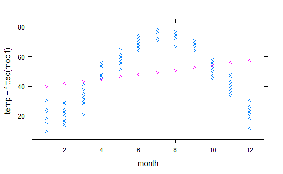
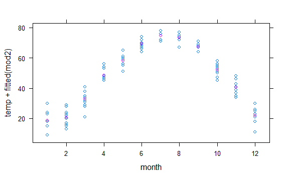

7 Model Formulas and Coefficients
================
Boukara Ahmed El-Hachemi
13/07/2020

The previous chapter presents models as graphs. The response variable is
plotted on the vertical axis and one of the explanatory variables on the
horizontal axis. Such a visual depiction of a model is extremely useful,
when it can be made. In such a graph, the relationship between the
response and explanatory variables can be seen as slopes or differences;
interactions can be seen as differences between slopes; the match or
mismatch between the data and the model can be visualized easily.

A graph is also a useful mode of communicating;

Presenting models via a graph is, regrettably, very limiting. The sorts
of models that can be graphed effectively have only one or two
explanatory variables, whereas often models need many more explanatory
variables. (There are models with thousands of explanatory variables,
but even a model with only three or four explanatory variables can be
impossible to graph in an understandable way.) Even when a model is
simple enough to be graphed, it’s helpful to be able to quantify the
relationships. Such quantification becomes crucial when you want to
characterize the reliability of a model or draw conclusions about the
strength of the evidence to support the claim of a relationship shown by
a model.

This chapter introduces important ways to present models in a
non-graphical way as formulas and as coefficients.

## 1 The Linear Model Formula

y = m x + b –equation describing a straight-line relationship:

x and y are the variables, m is the slope of the line, b is the
y-intercept – the place the line crosses the y axis.

consider this model of the relationship between an adult’s height and
the height of his or her mother, based on Galton’s height data.

height = 46.7 + 0.313 `mother`

This is a model represented not as a graph but as a ***model formula***.
If you make a graph of the model values of the response variable height
(of the adult child) against the values of the explanatory variable
mother, you will see a straight line with that slope and that intercept.

To find the model value given by the formula, just plug in numerical
values for the explanatory variable.

You can also interpret the model in terms of the relationship between
the child’s height and the mother’s height. Comparing two mothers who
differ in height by one inch, their children would typically differ in
height by 0.313 inches.

In the design language, the model is specified like this:

`height` \~ 1 + `mother`

There is a simple correspondence between the model design and the model
formula. The model formula takes each of the terms in the model design
and multiplies it by a number. The intercept term is multiplied by 46.7
and the `mother` term is multiplied by 0.313. Such numbers have a
generic name: ***model coefficients***. Instead of calling 0.313 the
“slope,” it’s called the “coefficient on the term `mother`.”
Similarly, 46.7 could be the “coefficient on the intercept term,” but it
seems more natural just to call it the intercept.

Where did these precise values for the coefficients come from? A process
called ***fitting the model to the data*** finds coefficients that bring
the model values from the formula to correspond as closely as possible
to the response values in the data. As a result, the coefficients that
result from fitting a given model design will depend on the data to
which the model is fitted. Chapter 8 describes the fitting process in
more detail.

## 2 Linear Models with Multiple Terms

It’s easy to generalize the linear model formula to include more than
one explanatory variable or additional terms such as interactions. For
each term, just add a new component to the formula. For example, suppose
you want to model the child’s height as a function of both the mother’s
and the father’s height. As a model design, take

`height` \~ 1 + `mother` + `father`

Here is the model formula for this model design fitted to Galton’s data:

*height* = 22.3 + 0.283 `mother` + 0.380 `father`

As before, each of the terms has its own coefficient. This same pattern
of terms and coefficients can be extended to include as many variables
as you like.

Interaction terms also fit into this framework. Suppose you want to fit
a model with an interaction between the father’s height and the mother’s
height. The model design is

`height` \~ 1 + `mother` + `father` + `father`:`mother`

For Galton’s data, the formula that corresponds to this design is

*height* = 132.3 - 1.43 `mother` - 1.21 `father` + 0.0247 `father` ×
`mother`

The formula follows the same pattern as before: a coefficient
multiplying the value of each term.

### Aside: Interpreting Interaction Terms

The numerics of interaction terms are easy. You just have to remember to
multiply the coefficient by the product of all the variables in the
term. The meaning of interaction terms is somewhat more difficult. Many
people initially mistake interaction terms to refer to a relationship
between two variables. For instance, they would (wrongly) think that an
interaction between mother’s and father’s heights means that, say, tall
mothers tend to be married to tall fathers. Actually, interaction terms
do not describe the relationship between the two variables, they are
about *three* variables: how one explanatory variable modulates the
effect of another on the response.

A model like `height` \~ 1+`mother`+`father` captures some of how a
child’s height varies with the height of either parent. The coefficient
on mother (when fitting this model to Galton’s data) was 0.283,
indicating that an extra inch of the mother’s height is associated with
an extra 0.283 inches in the child. This coefficient on `mother` doesn’t
depend on the father’s height; the model provides no room for it to do
so.

Suppose that the relationship between the mother’s height and her
child’s height is potentiated by the father’s height. This would mean
that if the father is very tall, then the mother has even more influence
on the child’s height than for a short father. That’s an interaction.

The coefficients from fitting this model to Galton’s data allow you to
compare what happens when the father is very short (say, 60 inches) to
when the father is very tall (say, 75 inches). With a short father, an
extra inch in the mother is associated with an extra 0.05 inches in the
child. With a tall father, an extra inch in the mother is associated
with an extra 0.42 inches in the child.

The interaction term can also be read the other way: the relationship
between a father’s height and the child’s height is greater when the
mother is taller.

Of course, this assumes that the model coefficients can be taken at face
value as reliable. Later chapters will deal with how to evaluate the
strength of the evidence for a model. It will turn out that Galton’s
data do not provide good evidence for an interaction between mother’s
and father’s heights in determining the child’s height.

## 3 Formulas with Categorical Variables

Since quantitative variables are numbers, they can be reflected in a
model formula in a natural, direct way: just multiply the value of the
model term by the coefficient on that term.

Categorical variables are a little different. They don’t have numerical
values. It doesn’t mean anything to multiply a category name by a
coefficient.

In order to include a categorical variable in a model formula, a small
translation is necessary. Suppose, for example, that you want to model
the child’s height by both its father’s and mother’s height and also the
sex of the child. The model design is nothing new: just include a model
term for `sex`.

`height` \~ 1 + `mother` + `father` + `sex`

The corresponding model formula for this design on the Galton data is

*height* = 15.3 + 0.322 `mother` + 0.406 `father` + 5.23 `sexM`

Interpret the quantitative terms in the ordinary way. The new term, 5.23
`sexM`, means “add 5.23 whenever the case has level M on sex.” This is a
very roundabout way of saying that males tend to be 5.23 inches taller
than females, according to the model.

Another way to think about the meaning of `sexM` is that it is a new
quantitative variable, called an ***indicator variable***, that has the
numeric value 1 when the case is level M in variable `sex`, and numeric
value 0 otherwise.

A categorical variable will have one indicator variable for each level
of the variable. Thus, a variable `language` with levels Chinese,
English, French, German, Hindi, etc. has a separate indicator variable
for each level.

For the `sex` variable, there are two levels: F and M. But notice that
there is only one coefficient for `sex`, the one for `sexM`. Get used to
this. Whenever there is an intercept term in a model, at least one of
the indicator variables from any categorical variable will be left out.
The level that is omitted is a ***reference level***. Chapter 8 explains
why things are done this way.

## 4 Coefficients and Relationships

One important purpose for constructing a model is to study the
relationships implied by your data between the explanatory variables and
the response. Measurement of the size of a relationship, often called
the ***effect size***, is based on comparing changes.

To illustrate, consider again this model of height:

*height* = 15.3 + 0.322 `mother` + 0.406 `father` + 5.23 `sexM`

What’s the relationship between `height` and `father`? One way to answer
this question is to pose a hypothetical situation. Suppose that the
value of father changed by one unit – that is, the `father` got taller.
How much would this change the model value of `height`.

Working through the arithmetic of the formula shows that a one-inch
increase in `father` leads to a 0.406 increase in the model value of
`height`. That’s a good way to describe the size of the relationship.

Similarly, the formula indicates that a 1 inch change in `mother` will
correspond to a 0.322 increase in the model value of `height`.

More generally, the size of a relationship between a quantitative
explanatory variable and the quantitative response variable is measured
using a concept from calculus: the ***derivative*** of the response
variable with respect to the explanatory variable. For those unfamiliar
with calculus, the derivative reflects the same idea as above: making a
small change in the explanatory variable and seeing how much the model
value changes.

For categorical explanatory variables, such as `sex`, the coefficient on
each level indicates how much difference there is in the model value
between the reference level and the level associated with the
coefficient. In the above model, the reference level is F, so the
coefficient 5.23 on `sexM` means that the model value for M is 5.23
inches larger than for F; more simply stated, males are, according to
the model, 5.23 inches taller than females. To avoid leading to a
mis-interpretation, it’s better to say that the model formula indicates
that males are, on ***average***, 5.23 inches taller than females.

The sign of a coefficient tells which way the relationship goes. If the
coefficient on `sexM` had been −5.23, it would mean that males are
typically shorter than females. If the coefficient on `mother` had been
−0.322, then taller mothers would have shorter children.

When there is an interaction or a transformation term in a model, the
effect size cannot be easily read off as a single coefficient. Those
familiar with calculus may recognize the connection to the *partial
derivative* in this approach of comparing model values due to a change
of inputs. Chapter 10 will consider the issues in more detail,
particularly the matter of ***holding constant*** other variables or
***adjusting*** for other variables.

## 5 Model Values and Residuals

If you plug in the values of the explanatory variables from your data,
the model formula gives, as an output, the model values. It’s rarely the
case that the model values are an exact match with the actual response
variable in your data. The difference is the *residual*.

For any one case in the data, the residual is always defined in terms of
the actual response variable and the model value that arises when that
case’s values for the explanatory variables are given as the input to
the model formula. For instance, if you are modeling `height`, the
residuals are

`height` = *height* + residuals

The residuals are always defined in terms of a particular data set and a
particular model. Each case’s residual would likely change if the model
were altered or if another data set were used to fit the model.

## 6 Coefficients of Basic Model Designs

To illustrate how basic model designs apply generally, I will use `A` to
stand for a generic response variable, `B` to stand for a quantitative
explanatory variable, and `G` for a categorical explanatory variable. As
always, `1` refers to the intercept term.

##### Model `A` \~ `1`

The model `A` \~ `1` is the simplest of all. There are no explanatory
variables; the only term is the intercept. Think of this model as saying
that all the cases are the same. In fitting the model, you are looking
for a single value that is as close as possible to each of the values in
`A`.

The coefficient from this model is the mean of `A`. The model values are
the same for every case: the mean of all the samples. This is sometimes
called the ***grand mean*** to distinguish it from group means, the mean
of `A` for different groups.

##### Model `A` \~ `1` + `G`

The model `A` \~ `1` + `G` is also very simple. The categorical variable
G can be thought of as dividing the data into groups, one group for each
level of G. There is a separate model value for each of the groups.

The model values are the group-wise means: separate means of `A` for the
cases in each group. The model coefficients, however, are not exactly
these group-wise means. Instead, the coefficient of the intercept term
is the mean of one group, which can be called the ***reference group***
or ***reference level***. Each of the other coefficients is the
*difference* between its group’s mean and the mean of the reference
group.

By suppressing the intercept term, you change the meaning of the
remaining coefficients; they become simple group-wise means rather than
the difference of the mean from a reference group’s mean. The model
`height` \~ `sex - 1`.

It might seem obvious that this simple form is to be preferred, since
you can just read off the means without doing any arithmetic on the
coefficients. That can be the case sometimes, but almost always you will
want to include the intercept term in the model. The reasons for this
will become clearer when hypothesis testing is introduced in later
chapters.

##### Model `A` \~ `1` + `B`

Model `A` \~ `1` + `B` is the basic straight line relationship. The two
coefficients are the intercept and the slope of the line. The slope
tells what change in A corresponds to a one-unit change in B.

##### Model `A` \~ `1` + `G` + `B`

The model `A` \~ `1` + `G` + `B` gives a straight-line relationship
between A and B, but allows different lines for each group defined by
`G`. The lines are different only in their intercepts; all of the lines
have the same slope.

The coefficient labeled “intercept” is the intercept of the line for the
reference group. The coefficients on the various levels of categorical
variable `G` reflect how the intercepts of the lines from those groups
differ from the reference group’s intercept.

The coefficient on `B` gives the slope. Since all the lines have the
same slope, a single coefficient will do the job.

Note that the model `A` \~ `1` + `G` + `B` is the same as the model `A`
\~ `1` + `B` + `G`. The order of model terms doesn’t make a difference.

##### Model `A` \~ `1` + `G` + `B` + `G:B`

The model `A` \~ `1` + `G` + `B` + `G:B` is also a straight-line model,
but now the different groups defined by `G` can have different slopes
and different intercepts. (The interaction term `G:B` says how the
slopes differ for the different group. That is, thinking of the slope as
effect of `B` on `A`, the interaction term `G:B` tells how the effect of
`B` is modulated by different levels of `G`.)

## 7 Coefficients have Units

A common convention is to write down coefficients and model formulas
without being explicit about the units of variables and coefficients.
This convention is unfortunate. Although leaving out the units leads to
neater tables and simpler-looking formulas, the units are fundamental to
interpreting the coefficients. Ignoring the units can mislead severely.

To illustrate how units come into things, consider the model design
`wages` \~ `1` + `educ` + `sex`. Fitting this model design to the
Current Population Survey gives this model formula:

*wage* = −1.93 + 0.742 `educ` + 2.27 `sexM`

A first glance at this formula might suggest that `sex` is more strongly
related than `educ` to `wage`. After all, the coefficient on educ is
much smaller than the coefficient on `sexM`. But this interpretation is
invalid, since it doesn’t take into account the units of the variables
or the coefficients.

The response variable, `wage`, has units of dollars-per-hour. The
explanatory variable `educ` has units of years. The explanatory variable
`sex` is categorical and has no units; the indicator variables for `sex`
are just zeros and ones: pure numbers with no units.

The coefficients have the units needed to transform the quantity that
they multiply into the units of the response variable. So, the
coefficient on educ has units of “dollars-per-hour per year.” This
sounds very strange at first, but remember that the coefficient will
multiply a quantity that has units of years, so the product will be in
units of dollars-per-hour, just like the `wage` variable. In this
formula, the units of the intercept coefficient and the coefficient on
`sexM` both have units of dollars-per-hour, because they multiply
something with no units and need to produce a result in terms of
dollars-per-hour.

A person who compares 0.742 dollars-per-hour per year with 2.27 dollars
per hour is comparing apples and oranges, or, in the metric-system
equivalent, comparing meters and kilograms. If the people collecting the
data had decided to measure education in months rather than in years,
the coefficient would have been a measly 0.742/12 = 0.0618 even though
the relationship between education and wages would have been exactly the
same.

### Aside: Comparing Coefficients

Coefficients and effect sizes have units. This imposes a difficulty in
comparing the effect sizes of different variables. For instance, suppose
you want to know whether `sex` or `educ` has a stronger effect size on
wage. The effect size of `sex` will have units of dollars per hour,
while the effect size of `educ` has units of dollars per hour per year.
To compare the two coefficients 0.742 and 2.27 is meaningless – apples
and oranges, as they say.

In order for the comparison to be meaningful, you have to put the effect
sizes on a common footing. One approach that might work here is to find
the number of years of education that produces a similar size effect of
education on wages as is seen with `sexM`. The answer turns out to be
about 3 years. (To see this, note that the wage gain associated with
`sexM`, 2.27 dollars per hour to the wage gain associated with three
years of education, 3 × 0.742 = 2.21 dollars per hour.)

Thus, according to the model of these data, being a male is equivalent
in wage gains to an increase of 3 years in education.

## 8 Untangling Explanatory Variables

Due to the relationships between explanatory variables, you need to
untangle them from one another. The way this is done is to use the
variables together in a model, rather than in isolation. The way the
tangling shows up is in the way the coefficient on a variable will
change when another variable is added to the model or taken away from
the model. That is, model coefficients on a variable tend to depend on
the context set by other variables in the model.

The situation where adding a new explanatory variable changes the sign
of the coefficient on another variable is called ***Simpson’s
paradox***.

Simpson’s Paradox is an extreme version of a common situation: that the
coefficient on an explanatory variable can depend on what other
explanatory variables have been included in the model. In other words,
the role of an explanatory variable can depend, sometimes strongly, on
the context set by other explanatory variables. You can’t look at
explanatory variables in isolation; you have to interpret them in
context.

But which is the right model? What’s the right context? This is an
important question and one that comes up often in statistical modeling.
At one level, the answer is that you need to be aware that context
matters. At another level, you should always check to see if your
conclusions would be altered by including or excluding some other
explanatory variable. At a still higher level, the choice of which
variables to include or exclude needs to be related to the modeler’s
ideas about what causes what.

### Aside: Interaction terms and partial derivatives

The mathematically oriented reader may recall that one way to describe
the effect of one variable on another is a partial derivative: the
derivative of the response variable with respect to the explanatory
variable. The interaction – how one explanatory variable modulates the
effect of another on the response variable – corresponds to a mixed
second-order partial derivative. Writing the response as z and the
explanatory variables as x and y, the interaction corresponds to
∂²z/∂x∂y which is exactly equal to ∂²z/∂y∂x. That is, the way
that x modulates the effect of y on z is the same thing as the way that
y modulates the effect of x on z.

## 9 Why Linear Models?

Many people are uncomfortable with using linear models to describe
potentially complicated relationships. The process seems a bit
unnatural: specify the model terms, fit the model to the data, get the
coefficients. How do you know that a model fit in this way will give a
realistic match to the data? Coefficients seem an overly abstract way to
describe a relationship. Modeling without graphing seems like dancing in
the dark; it’s nice to be able to see your partner.

However, the advantages of graphing are obvious only in retrospect, once
you have found a suitable graph that is informative. Why graph world
record time against year? Why not graph it versus body weight of the
swimmer or the latitude of the pool in which the record was broken?

Researchers decide to collect some variables and not others based on
their knowledge and understanding of the system under study. People
know, for example, that world records can only get better over the
years. This may seem utterly obvious but it is nonetheless a bit of
expert knowledge. It is expert knowledge that makes `year` an obvious
explanatory variable. In general, expert knowledge comes from experience
and education rather than data. It’s common knowledge, for example, that
in many sports, separate world records are kept for men and women. This
feature of the system, obvious to experts, makes `sex` a sensible choice
as an explanatory variable.

Humans are powerful pattern recognition machines. People can easily pick
out faces in a crowd, but they can also pick out faces in a cloud or on
the moon. The downside to using human criteria to judge how well a model
fits data is the risk that you will see patterns that aren’t warranted
by the data.

To avoid this problem, you can use formal measures of how well a model
fits the data, measures based on the size of residuals and that take
into account chance variations in shape. Much of the rest of the book is
devoted to such measures.

With the formal measures of fit, a modeler has available a strategy for
finding effective models. First, fit a model that matches, perhaps
roughly, what you know about the system. Check how good the fit is.
Then, try refining the model, adding detail by including curvy
transformation terms. Check the fit again and see if the improvement in
the fit goes beyond what would be expected from chance.

A reasonable strategy is to start with model designs that include only
main terms for your explanatory variables (and, of course, the intercept
term, which is to be included in almost every model). Then add in some
interaction terms, see if they improve the fit. Finally, you can try
transformation terms to capture more detail.

Most of the time you will find that the crucial decision is which
explanatory variables to include. Since it’s difficult to graph
relationships with multiple explanatory variables, the benefits of
making a snug fit to a single variable are illusory.

Often the relationship between an explanatory variable and a response is
rather loose. People, as good as they are at recognizing patterns,
aren’t effective at combining lots of cases to draw conclusions of
overall patterns. People can have trouble seeing for forest for the
trees. Start with the straight-line terms then see if elaboration is
warranted.

There are, however, some situations when you can anticipate that
straight-line model terms will not do the job. For example, consider
temperature versus month in a strongly seasonal climate: temperature
goes up and then down as the seasons progress. Or consider the
relationship between college grades and participation in
extra-curricular activities such as school sports, performances, the
newspaper, etc. There’s reason to believe that some participation in
extra-curricular activities is associated with higher grades. This might
be because students who are doing well have the confidence to spend time
on extra-curriculars. But there’s also reason to think that very heavy
participation takes away from the time students need to study. So the
overall relationship between grades and participation might be Λ-shaped.
Relationships that have a V- or Λ-shape won’t be effectively captured by
straight-line models; transformation terms and interaction terms will be
required.

-----

## Computational Technique

### Examining model coefficients

``` r
mod <- lm(time ~ year + sex, data = SwimRecords)

coef(mod)
```

As shorthand to display the coefficients, just type the name of the
object that is storing the model:

``` r
mod
```

A more detailed report can be gotten with `summary`, This gives
additional statistical information that will be used in later chapters:

``` r
summary(mod)
```

From time to time in the exercises, you will be asked to calculate model
values “by hand.” This is accomplished by multiplying the coefficients
by the appropriate values and adding them up. For example, the model
value for a male swimmer in 2010 would be:

``` r
555.7 - 0.2515 * 2010 - 9.798
```

Notice that the “value” used to multiply the intercept is always 1, and
the “value” used for a categorical level is either 0 or 1 depending on
whether there is a match with the level.

When a model includes interaction terms, the interaction coefficients
need to be multiplied by all the values involved in the interaction.

``` r
mod2 <- lm(time ~ year * sex, data = SwimRecords)
coef(mod2)
```

The year:sexM coefficient is being multiplied by the year (2010) and the
value of sex M, which is 1 for this male swimmer.

``` r
697.3 - 0.3240 * 2010 - 302.4638 + 0.1499 * 2010
```

### Other Useful Operators

##### `cross()` will combine two categorical variables into a single variable.

For example, in the Current Population Survey data, the variable `sex`
has levels F and M, while the variable `race` has levels W and NW.
Crossing the two variables combines them; the new variable has four
levels: F.NW, M.NW, F.W, M.W:

``` r
CPS <- CPS85
racesex <- cross(CPS$sex, CPS$race)
summary(racesex)
```

The summary tells us that there are 28 non-white females, 270 white
females, etc, in the new categorical variable called `racesex`.

##### `as.factor()` will convert a quantitative variable to a categorical variable.

This is useful when a quantity like month has been coded as a number,
say 1 for January and 2 for February, etc. but you do not want models to
treat it as such.

To illustrate, consider two different models of the usage temperature
versus month:

``` r
utils <- Utilities
mod1 <- lm(temp ~ month, data = utils)
mod2 <- lm(temp ~ as.factor(month), data = utils)
```

Here are the graphs of those models:

``` r
xyplot(temp + fitted(mod1) ~ month, data = utils)
```



``` r
xyplot(temp + fitted(mod2) ~ month, data = utils)
```



In the first model, month is treated quantitatively, so the model term
month produces a straight-line relationship that does not correspond
well to the data.

In the second model, month is treated categorically, allowing a more
complicated model relationship. In fact, this is a groupwise model: the
model values represent the mean temperature for each month.
